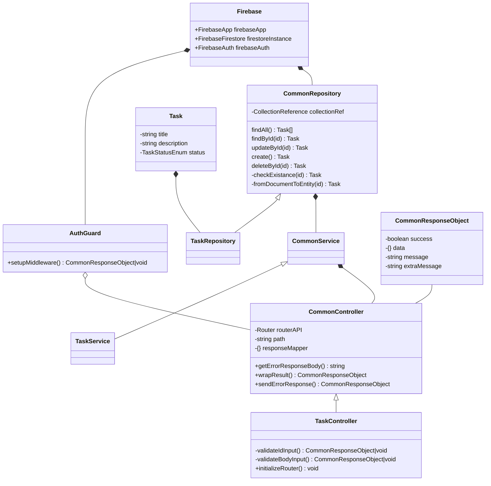
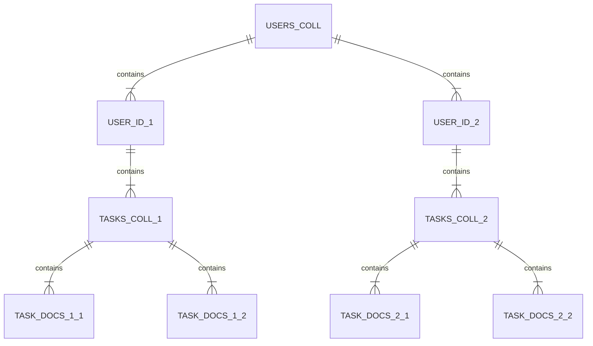

# Atom Challenge

Hi, folks! ♡

In this opportunity, I was asked to solve a full stack challenge from [Atom](https://atomchat.io/) company. So, below I'll describe my approach and solutions.

## Description

> Build a REST API making use of Firebase and TypeScript. This API
> should allow the user to add, edit and delete tasks from a Firebase
> Firestore database.  (basically a CRUD from scratch using Express + TS
> + Firebase Admin, but I wanted to go further).
> 
> ### Requirements
> 
> #### Firebase usage Setup a Firebase project and make use of Firebase Firestore as database (not the Real Time one).
> 
> #### Data model Create a data model to store a task that includes these fields:
>  - Title
>  - Description
>  - Status (Pending/Completed)
> 
> #### API Endpoints Build and serve the following endpoints:
>  - **GET /tasks**: Get the full tasks list.
>  - **POST /tasks**: Add a new task.
>  - **PUT /tasks/{taskId}**: Update an existing task.
>  - **DELETE /tasks/{taskId}**: Delete an existing task.
> 
> #### What we will evaluate
>  - **Firebase & TypeScript knowledge**: the way you explode the offerings from Firebase, and your capability of making use of
> TypeScript within Backend Apps.
>  - **Project structure and Design**: how you organize and structure the Backend App making use of the best arch practices and
> responsability encapsulation.
>  - **Data model**: your design and data model building skills in order to achieve an efficient and scalable product.
>  - **API development**: the way you define the API endpoints ensuring that you completely cover every single requirement.
>  - **Validations**: the validation strategy you create in order to check that all the required fields have been sent and their format is
> correct.
>  - **Tests**: whether if you add some automated testing to verify the right functionability of your application at build time making use of
> Jest or Firebase Emulator Suite.
> 
> #### Challenge deliver
>  - Upload the source code of the application within a public GitHub repository.
>  - Deploy and serve the app on a hosting platform of your preference (i.e. https://stackblitz.com/). Or, as the worst alternative, just
> write instructions in Readme to run your app.
>  - Include a brief description and explanation over your design decissions and used technologies and/or some relevant feedback.

## Solution

### Design and source code structure
To solve this challenge I came accross with an Object Oriented solution with a Layered project structure where you will find every element isolated in their own folder with a descriptive name.
The solution involves the following folders: 
 - **config**: includes all instances of the external services and tools modules like the definition of Firebase Admin, Firebase Auth and Firebase Firestore. Plus the definition of the environment file the application will use.
 - **controllers**: it contains all the controller classes which are the ones in charge of adding Express Routers with the exposed endpoints.
 - **middlewares**: all the global declared middlewares, in this case, the only class I defined was an Auth Guard to evaluate the existance and validation of the received Firebase Auth token within Authorization header.
 - **model**: everything that is related to entities, dtos or enums that involves or is an element of a type of I/O files.
 - **repository**: interfaces to interact with the database.
 - **service**: every controller define the endpoints and call a service method which is in charge of resolve all the business logic behind an endpoint including making use of the database interfaces I've mentioned previously.
 - **utils**: internal useful types or common functions/modules.
 - **tests**: all the unit tests to check application functionality mocking every external service interaction since the only thing I'm testing here is this Express app and not its relations (doing this will result in integration test, which is out of scope in here).

Besides these files and folders, I created the index file which is the root of the project defining Express application with its routers, middlewares and port.

### Data model

When it comes to store the tasks data, I decided to simply create an entity, I mean a collection 'tasks' in Firestore with a bunch of documents related to every single task that is created in the app.

But, later it became a little bit more interesting when I added the authentication because I needed to link tasks with their own tasks, this could be solved with two approachs, in regular relational DBMS it's a many to one relation, which would involve an attribute as a foreign key in Task entity indicating its corresponding user.

On the other hand, with this Non-Relational DBMS I found out an easier solution, Firebase admits the cycle Collection -> Document -> Collection -> Document and so on. So, I only needed to change the collection ref adding one collection and document before the previous path. And just that small change did the trick, I ended up having a collection for Users with a bunch of documents which are Users IDs from Firebase Auth, and underneath each user, the collection with tasks I had at first. 

One thing that's important here is the fact that in order to achieve this approach, I first had to shrink both services and repositories scope because the Firestore collection reference now depends on the user who changes on each request.
Here an ERD (notice the app support n user_ids and n tasks. I used only two to summarize):

## Distribution

To distribute the app I've used Firebase Hosting, since the challenge asked for a Firebase related app, I decided to go ahead and distribute both [Frontend](https://atom-challenge-f2f3d.web.app/) ([repo](https://github.com/ffedelefrsf/AtomChallenge-Frontend)) and [Backend](https://atomchallenge-backend.web.app/api/) ([this](https://github.com/ffedelefrsf/AtomChallenge#atom-challenge)) within the created app in Firebase.
